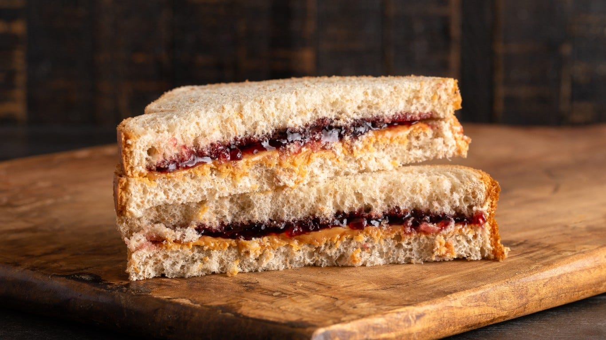
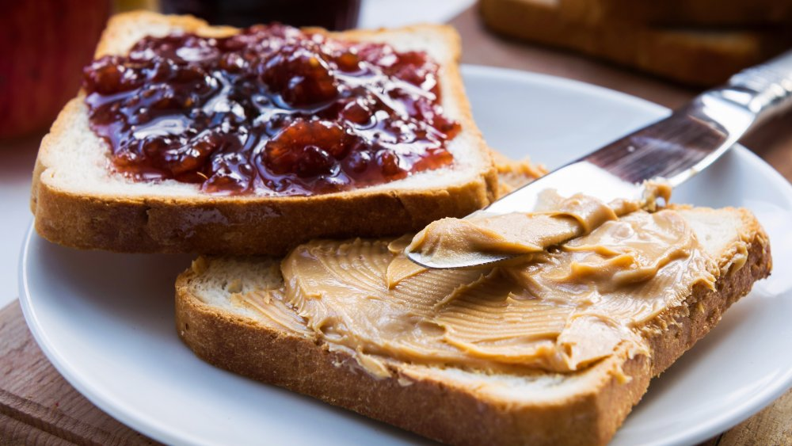
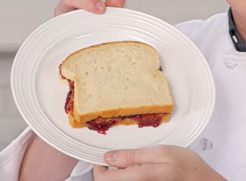
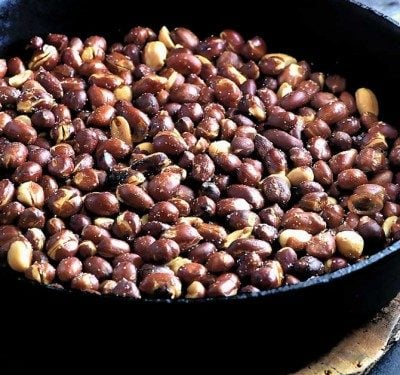
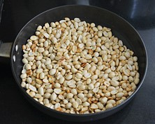
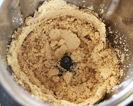
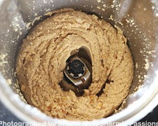
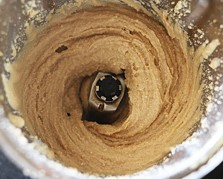
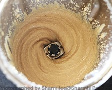
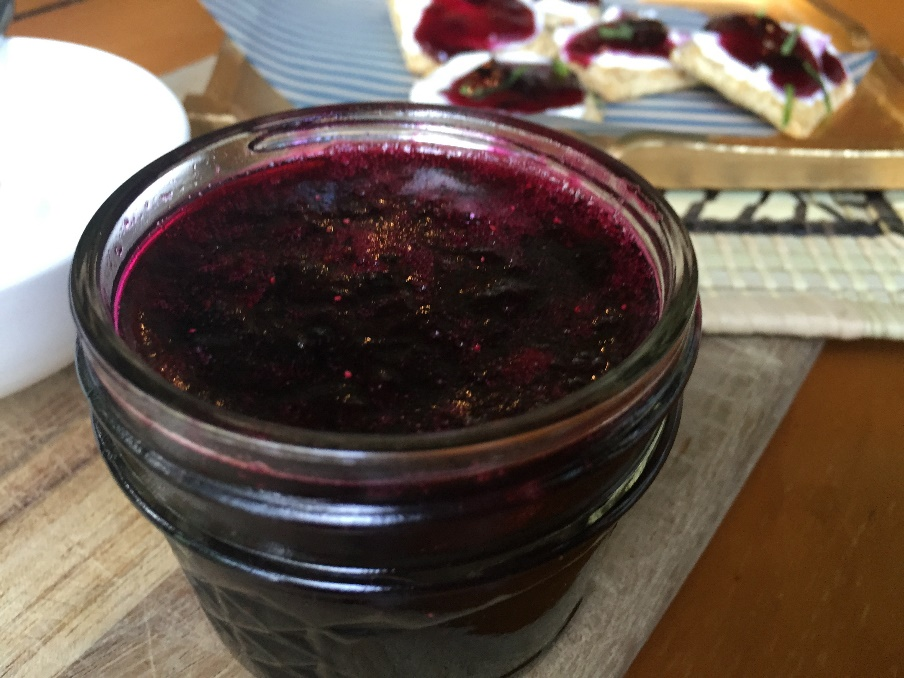

# Peanut Butter Jelly Sandwich

A peanut butter jelly sandwich comprises of peanut butter and jelly spread over bread. Is is an easy and quick breakfast to make for bith parents as well as kids.

    

## Table of Contents
- [Receipe](#receipe)
    - [Ingredients](#ingredients)
    - [Method](#method)
- [Peanut Butter at Home](#peanut-butter-at-home)
- [Fresh Jelly at Home](#fres-jelly-at-home)
- [References](#references)

## Receipe

Preparation time – 5 mins
### Ingredients
- Bread
- Peanut butter
- Jelly

### Method
1. Take two slices of bread. 
2. Spread peanut butter on one and jelly on the other.
    

        
    

    [Note: Do not put butter on both slices or else the jelly will slide out having nothing to cling to.]
    

        
    

4. Take the butter slice and hold it on top of the jelly slice. Flip it back for solid foundation and cut the sandwich diagonally.
5. Peanut butter jelly sandwich is ready to serve.

## Peanut Butter at Home

Preparation time – 10 mins
### Ingredients
|Item| Quantity|
|---|---|
|Roasted peanuts|2 cups|
|Peanut oil/ vegetable oil|1 tsp (optional)|
|Honey| 1 tblsp (optional)|
|Salt| a pinch|
### Procedure
1. Take two cups of roasted peanuts. If you have not then -
    - Take normal peanuts in a pan and roast them until they turn golden brown and the skin starts to peel off.
    - Or preheat the oven to 350 F and place the raw peanuts in a baking pan. Now bake for 15 to 20 minutes, stirring once or twice during cooking, until the skins become loose and the peanuts are lightly golden.
    - To remove the skin of roasted peanuts completely, take them in the palm and rub. You can also put them in a cloth and then rub it. If the skin is left then it will lead to a slightly bitter taste.
    

        
        
    

2. After the skin is peeled off, take the peanuts and put them in a blender and mix them until turns into a powder.

        
    

3. Stop the blender and remove the powder from the sides and bottom of the blades. Again, blend it for few seconds until it starts turning to a thick paste.

        
    

4. Now at this point, oil starts coming out from inside the peanuts. Add oil and honey, completely optional, and salt to the paste and mix well using a spatula. Again, start blending until the thick paste turns to thin one.

        
    

5. Check ones again and mix the paste well. And finally blend for few more seconds till the paste becomes smooth.

        
    

6. Pour the paste out from the blender and now the peanut butter is ready to use.

## Fresh Jelly at Home
Preparation time – 10 mins and cooling 2-3 hours
### Ingredients
|Item| Quantity|
|---|---|
|Fresh fruits/ food essence and food colour |1 tsp|
|Sugar| ½ cup|
|Gelatine | 4 tsp| 
|Lime juice | 1 tbsp|
|Water | 2 ½ cup|
### Procedure:
1. If you are using fresh fruits then blend them and make a thick puree. If not then jump to step no. 4.
2. Take a saucepan and add the puree to it and then sugar. Add 2 cups of water, mix them and boil for few minutes.
3. Now add gelatine to the mixture and again boil for few minutes with continuous stirring to remove any lumps.
4. Take ½ cup of water and add gelatine to it. Mix them well to remove any lumps.
5. Put 2 cups of water in a saucepan and add sugar and lime juice. Mix them well and boil water for 1-2 minutes at medium flame till the sugar gets dissolved.
6. Now add the gelatine mixture to the water and mix them. Again, boil for 1-2 minutes till the mixture turns to smooth jelly.
7. Pour out the jelly mixture in the jar or mould and add essence and food colour both 1 tsp. This step is followed when the fruit puree is not used.
8. Leave the jelly to bring it down to the room temperature. And finally cool them in the refrigerator for 2-3 hours.
9. Take out the jelly from refrigerator and now it is ready to use. 

        
    

## References

- [Peanut Butter Jelly Sandwich](https://www.youtube.com/watch?v=N9GxhnKO9aA)
- [Peanut Butter](https://www.youtube.com/watch?v=a7Cb9ne-w2M)
- [Jelly from Fresh Fruits](https://www.youtube.com/watch?v=ksssM0T163A)
- [Jelly from Essance](https://www.youtube.com/watch?v=V_7vjw4CDMM)
- [Fruits Suggestions for Jelly](https://www.masterclass.com/articles/how-to-make-easy-homemade-jelly-basic-jelly#what-fruits-can-you-jelly)
- [Tips for Perfect Jelly](https://www.masterclass.com/articles/how-to-make-easy-homemade-jelly-basic-jelly#3-tips-for-making-perfect-homemade-jelly)
- [Flavour Combinations for Jelly](https://www.masterclass.com/articles/how-to-make-easy-homemade-jelly-basic-jelly#3-flavor-combinations-for-homemade-jelly)
